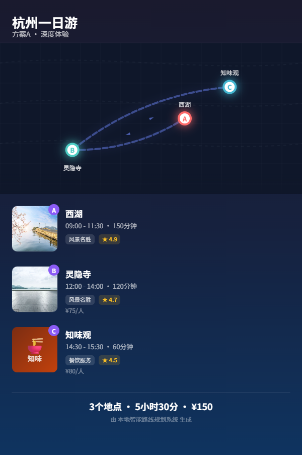
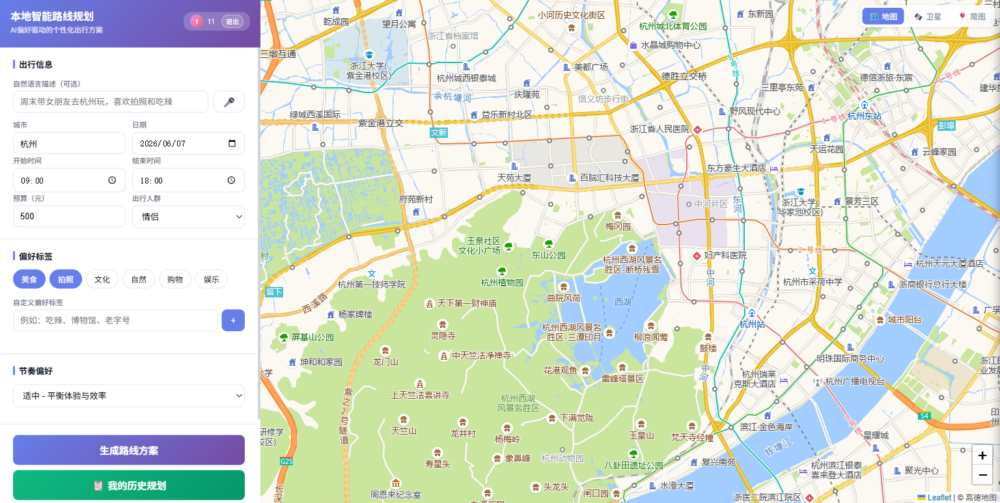
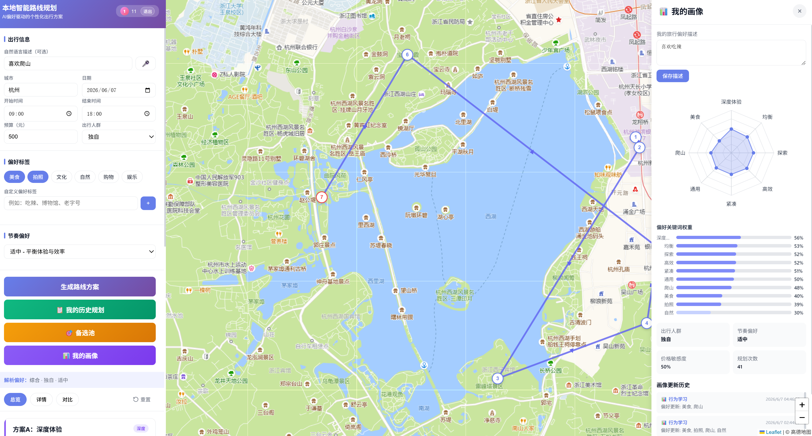
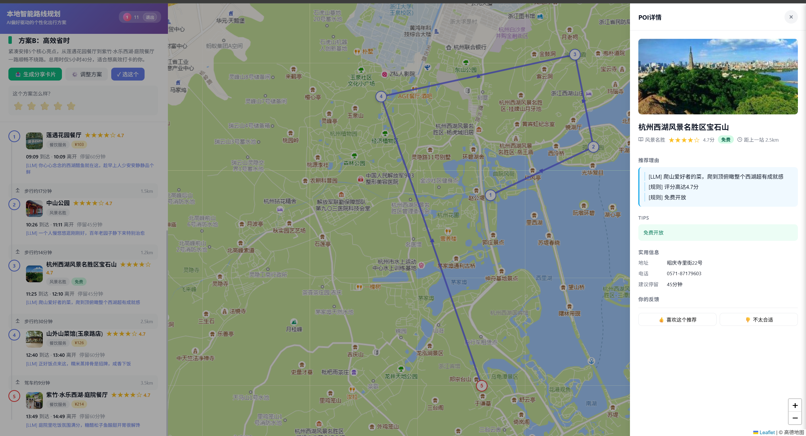
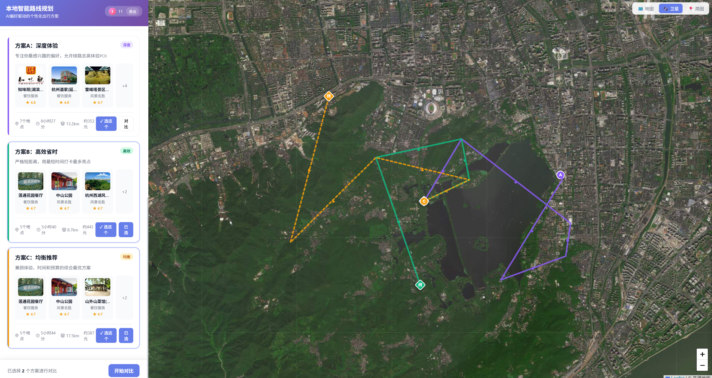
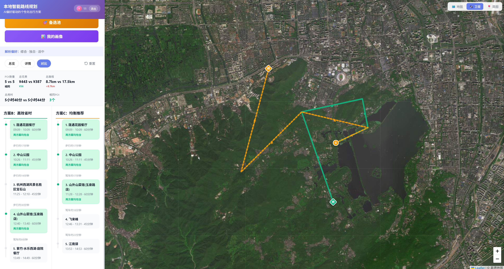

# 🗺️ Local Intelligent Route Planning System

<p align="center">
  
  
  
  
</p>

<p align="center">
  English | <a href="README.md">简体中文</a>
</p>

<p align="center">
  <b>Preference-Driven Intelligent Local Route Planning — Long-Term Evolution via LLM + Classical Algorithms + User Profiling</b>
</p>

---

## ✨ Core Features

| Feature | Description |
|---------|-------------|
| 📝 **Natural Language Planning** | "Weekend trip to Hangzhou with my girlfriend, love photography and spicy food" → LLM auto-extracts structured preferences |
| 🧠 **Hybrid AI Retrieval** | Local BGE semantic model (zero network dependency) for coarse ranking + LLM fine ranking + rule-based fallback |
| 🗺️ **Hand-Drawn Route Map** | Shareable card with embedded Canvas hand-drawn route (glowing nodes + Bézier curves + direction arrows) |
| 👤 **User Profile Evolution** | Dual-track updates: behavioral EMA learning + conversational LLM incremental extraction, with rule-based fallback to prevent 429 |
| 🎯 **Three Differentiated Plans** | Deep Experience / Time Efficient / Balanced Recommendation — physically isolated candidate sets ensure differentiation |
| 📊 **Interactive Profile Panel** | Dynamic radar chart + keyword weight bar chart + update history + version traceability |
| 🔄 **Alternative Pool Incremental Arrangement** | Top-40 candidate pool supports click-to-select, real-time recalculation of personalized routes |
| 📤 **Stunning Share Card** | Canvas-generated 9:16 card with real POI images + route map + statistics |

---

## 🏗️ Technical Architecture

```
┌─────────────────────────────────────────────────────────────┐
│                        Frontend Layer                       │
│  Leaflet.js + Vanilla JS (Single Page App, ~3700 lines)     │
│  ├─ Interactive Map (AMap tiles: Map / Satellite / Simple)  │
│  ├─ Three Plan Cards + Timeline Details + Plan Comparison   │
│  ├─ Alternative Pool Panel (Top-40 candidate POIs, click → map locate) │
│  ├─ Profile Radar Panel (Dynamic keywords + update history) │
│  ├─ Share Card Generator (Canvas hand-drawn route + real images) │
│  └─ Voice Input + Custom Preference Tags                    │
└──────────────────────────┬──────────────────────────────────┘
                           │ HTTP / CORS
┌──────────────────────────▼──────────────────────────────────┐
│                        API Layer                            │
│  FastAPI + Pydantic v2 + Uvicorn                            │
│  ├─ /api/plan         Route planning (anonymous / logged-in)│
│  ├─ /api/plan/{id}/adjust   Dynamic adjustment / incremental arrangement │
│  ├─ /api/user/profile       User profile GET/PUT            │
│  ├─ /api/user/select-plan   Plan selection (triggers profile evolution) │
│  ├─ /api/proxy-image        Image proxy (bypass CORS)       │
│  └─ /api/cities/{city}/init City data async build           │
└──────────────────────────┬──────────────────────────────────┘
                           │
┌──────────────────────────▼──────────────────────────────────┐
│                       Business Engine Layer                 │
│  ┌─────────────┐  ┌─────────────┐  ┌─────────────────────┐  │
│  │ LLM Parser  │  │ HybridFilter│  │ SemanticMatcher     │  │
│  │ Intent Parse│  │ Rules+Embed │  │ BGE-small-zh-v1.5   │  │
│  └─────────────┘  └─────────────┘  └─────────────────────┘  │
│  ┌─────────────┐  ┌─────────────┐  ┌─────────────────────┐  │
│  │ PolicyGen   │  │ RouteEngine │  │ Personalization     │  │
│  │ Policy Gen  │  │ Greedy+2-opt│  │ Dual-Track Evolution│  │
│  └─────────────┘  └─────────────┘  └─────────────────────┘  │
│  ┌─────────────┐  ┌─────────────┐  ┌─────────────────────┐  │
│  │ LLMReranker │  │ LLMReasoner │  │ Evaluator           │  │
│  │ POI Rerank  │  │ Reason Gen  │  │ 5D Auto Evaluation  │  │
│  └─────────────┘  └─────────────┘  └─────────────────────┘  │
└──────────────────────────┬──────────────────────────────────┘
                           │
┌──────────────────────────▼──────────────────────────────────┐
│                        Data Layer                           │
│  ┌─────────────┐  ┌─────────────┐  ┌─────────────────────┐  │
│  │ SQLite      │  │ JSON POI    │  │ Distance Matrix     │  │
│  │ Users/History│ │ City Data   │  │ OSRM/Haversine      │  │
│  │ Profile Ver.│  │             │  │                     │  │
│  └─────────────┘  └─────────────┘  └─────────────────────┘  │
│  ┌─────────────────────────────────────────────────────┐    │
│  │ Local Model: data/models/bge-small-zh-v1.5/ (184MB) │    │
│  └─────────────────────────────────────────────────────┘    │
└─────────────────────────────────────────────────────────────┘
```

---

## 🚀 Quick Start

### Requirements

- Python 3.12+
- LLM API Key (OpenAI-compatible, e.g., MiniMax / Kimi) — for natural language parsing
- AMap Key — for dynamic city POI fetching (optional, built-in data available)

### Installation & Launch

```bash
# 1. Clone the project
git clone <repo-url>
cd local-route-planner

# 2. Create virtual environment
python -m venv venv

# 3. Activate (Windows)
venv\Scripts\activate

# 4. Install dependencies
pip install -r requirements.txt

# 5. Configure environment variables
cp .env.example .env
# Edit .env, fill in LLM_API_KEY and AMAP_KEY

# 6. Start backend
python -m backend.main

# 7. Start frontend (new terminal)
cd frontend
python -m http.server 8080
```

Visit http://localhost:8080 for the frontend, http://localhost:8000/docs for API documentation.

---

## 📁 Project Structure

```
├── backend/
│   ├── main.py                 # FastAPI entry point
│   ├── core/                   # Core engines
│   │   ├── route_engine.py     # Route planning (Greedy + 2-opt)
│   │   ├── hybrid_filter.py    # Hybrid POI retrieval (Rules + BGE + LLM)
│   │   ├── semantic_matcher.py # BGE semantic matching (local model)
│   │   ├── llm_parser.py       # LLM intent parsing
│   │   ├── llm_reranker.py     # LLM POI reranking
│   │   ├── llm_reasoner.py     # Recommendation reason generation
│   │   ├── personalization.py  # User profile engine (dual-track evolution)
│   │   ├── policy_generator.py # Planning policy generation
│   │   └── evaluator.py        # Plan evaluator
│   ├── services/
│   │   ├── planner.py          # Business orchestration service
│   │   └── auth.py             # JWT authentication service
│   ├── models/
│   │   ├── schemas.py          # Core data models
│   │   └── auth_schemas.py     # Authentication models
│   ├── data/
│   │   ├── loader.py           # Data loader
│   │   └── city_builder.py     # City data builder
│   └── db/
│       ├── database.py         # SQLite connection
│       └── models.py           # DAO layer
├── frontend/
│   └── index.html              # Single Page App (Leaflet + Canvas)
├── scripts/                    # Data collection & processing scripts
│   ├── fetch_pois_amap.py      # AMap POI collection
│   ├── enrich_pois_by_llm.py   # LLM data enrichment
│   ├── compute_distance_matrix.py
│   └── build_real_pois_pipeline.py
├── data/
│   ├── app.db                  # SQLite production database
│   ├── models/                 # BGE embedding model (built-in)
│   ├── *_pois.json             # City POI data
│   └── distance_matrix_*.json  # Distance matrices
├── tests/                      # Unit tests & E2E tests
└── docs/                       # Design docs & Prompt templates
```

---

## 🔧 Core Technologies

### Complete Route Generation Flow

```
User Input (Natural Language / Preference Tags / Constraints)
    │
    ├──→ Step 1: Preference Parsing
    │       ├── LLM Parser: raw_query → structured preferences (theme weights, crowd, pace, budget sensitivity)
    │       └── Fallback: Rule parsing (fixed tag mapping to weight dict)
    │
    ├──→ Step 2: Historical Profile Fusion
    │       ├── Load user long-term profile (SQLite: theme_weights, traveler_type, pace, etc.)
    │       ├── Current preference ⊗ Historical preference = fused preference (EMA weighting, historical weight decays with planning count)
    │       └── Profile description appended to raw_query (provides long-term context for LLM)
    │
    ├──→ Step 3: POI Data Retrieval
    │       ├── Load city cached POIs (JSON: name, location, category, tags, rating, price, photos, business_hours)
    │       ├── Dynamic fetch supplement (AMap API search by user query + LLM landmark scoring, deduplicated and merged into candidate pool)
    │       └── Quality filtering (exclude non-tourism categories, low ratings, distant POIs)
    │
    ├──→ Step 4: Hybrid POI Filtering (Query complexity determines path)
    │       │
    │       ├── SIMPLE path (no natural language)
    │       │   └── Pure rule hard constraints: business hours filter + distance threshold + must-visit/avoid + category quotas
    │       │
    │       ├── HYBRID path (simple natural language)
    │       │   ├── Rule hard constraint filtering
    │       │   └── BGE semantic coarse ranking: fused preference keywords ↔ POI (name+category+tags) 512-dim cosine similarity
    │       │
    │       └── COMPLEX path (rich natural language)
    │           ├── Rule hard constraint filtering
    │           ├── BGE semantic coarse ranking (Top-50)
    │           └── LLM fine ranking (Top-20): incorporates UGC sentiment ("photo-friendly", "not crowded"), crowd fit, POI synergy
    │
    ├──→ Step 5: Policy Generation (PolicyGenerator)
    │       └── Generate 3 PlanningPolicies based on fused preferences (different scoring weights)
    │           ├── Deep Experience: preference_match 0.6 + experience 0.25 + time_efficiency 0.15
    │           ├── Time Efficient: preference_match 0.2 + experience 0.2 + time_efficiency 0.6
    │           └── Balanced: preference_match 0.35 + experience 0.3 + time_efficiency 0.35
    │
    ├──→ Step 6: Route Planning × 3 (RouteEngine)
    │       ├── Greedy construction: select POIs with highest marginal value step by step (score × preference match × time efficiency × distance penalty)
    │       ├── Mandatory dining insertion: lunch (11:30-13:30) / dinner (17:00-19:00) slots auto-insert dining POIs
    │       ├── Business hours filtering: ensure arrival time within open_hours
    │       ├── 2-opt optimization: local swap to reduce backtracking, optimize time cost
    │       └── Budget constraint: total cost within user budget
    │
    ├──→ Step 7: LLM Recommendation Reason Generation
    │       ├── Overall reason: explain route design philosophy ("Since you love photography, West Lake is scheduled in the morning...")
    │       └── Per-POI reason: selection basis for each node (rating, preference fit, unique experience)
    │
    └──→ Step 8: Dual-Track Profile Update (async, non-blocking)
            ├── Track 1 (Behavioral EMA): plan selection / POI like/dislike → infer theme preference → EMA smoothing → write to SQLite
            └── Track 2 (Conversation Incremental): raw_query → LLM extracts preference changes → if LLM 429, rule fallback extracts keywords → write to SQLite + version history
```

### How Historical User Preferences Are Integrated

- **Cold Start**: Optional `profile_text` at registration, LLM parses into initial profile; or directly fill in profile description
- **Each Planning**: `fuse_preferences(current_pref, historical_pref)` fuses current request preferences with long-term profile using weighted EMA; historical weight decays as `total_plans_generated` increases (new user gamma=0.5, old user gamma=0.1)
- **Auto Profile Description Injection**: User's long-term profile description (e.g., "I love photography and off-the-beaten-path spots") is automatically prepended to `raw_query` header, so LLM knows user's long-term preferences when parsing the current request

### How POI Data and Services Are Integrated

| Data Source | Content | Usage |
|-------------|---------|-------|
| **AMap API Collection** | name, location (GCJ-02), category, rating, photos | Base POI pool, directly used for retrieval and display |
| **LLM Enrichment** | tags, suitable_for, tips, business_hours, price | Enriches POI attributes, used for semantic matching and recommendation reasons |
| **Dynamic Fetch** | Precise POIs searched in real-time by user query | Supplements missing POIs in base pool, expands candidate set |
| **User Review Corpus** | UGC tags ("photo-friendly", "good value") | Used as context input in COMPLEX path LLM fine ranking stage, affects reranking and recommendation reasons |
| **Distance Matrix** | OSRM walking / Haversine | Calculates POI-to-POI distance and time cost in route planning |

### Three Retrieval Paths vs Three Plans

| | **Three Retrieval Paths** (SIMPLE/HYBRID/COMPLEX) | **Three Differentiated Plans** (Deep Experience / Time Efficient / Balanced) |
|--|---------------------------------------------------|------------------------------------------------------------------------------|
| **Stage** | POI filtering stage | Route planning stage |
| **Determined by** | User input complexity (presence of natural language) | User preference type (leisure / compact / balanced) |
| **Output** | 1 candidate POI pool (Top-40~50) | 3 different routes |
| **Code location** | `hybrid_filter.py` | `policy_generator.py` + `route_engine.py` |

**Key**: Regardless of which retrieval path is taken, 3 plans are ultimately generated. The retrieval path determines "candidate POI quality," while plan policy determines "route design philosophy."

### Share Card Generation

- **Route Map**: Canvas hand-drawn (grid background + Bézier curves + glowing nodes + direction arrows)
- **Real Images**: AMap POI photos downloaded via `/api/proxy-image` backend proxy, converted to base64 and drawn on canvas
- **Dynamic Height**: Canvas height auto-calculated based on POI count, no blank space

---

## 📸 Project Showcase

### 1. Share Card
Real POI images + Canvas hand-drawn route map + dynamic height, generates 9:16 share card.



### 2. Frontend Main Interface
Left preference form (natural language + tags + constraints), right Leaflet AMap, supports map / satellite / simple view switching.



### 3. User Profile Panel
Dynamic radar chart displaying preference keywords, bar chart showing weights, records source and history of each profile update.



### 4. POI Detail Panel
Real photos, LLM-generated recommendation reasons, practical info (address / phone / business hours), user feedback (like / dislike).



### 5. Three Plans Comparison
Deep Experience / Time Efficient / Balanced three plans displayed side by side, corresponding routes drawn on map simultaneously.




---

## 🌐 API Overview

| Method | Path | Description |
|--------|------|-------------|
| `GET` | `/` | Health check |
| `POST` | `/api/auth/register` | User registration (optional profile text initialization) |
| `POST` | `/api/auth/login` | User login |
| `GET` | `/api/user/profile` | Get user profile (includes theme_weights radar data) |
| `PUT` | `/api/user/profile` | Update profile (description / weights / scalar fields) |
| `GET` | `/api/user/profile/history` | Profile version history |
| `POST` | `/api/plan` | Create route plan |
| `GET` | `/api/plan/{id}` | Get planning result |
| `POST` | `/api/plan/{id}/adjust` | Dynamic adjustment (replan / arrange) |
| `GET` | `/api/plan/{id}/candidates` | Get Top-40 candidate pool |
| `POST` | `/api/user/select-plan` | Record plan selection (triggers profile evolution) |
| `POST` | `/api/user/feedback` | POI like/dislike feedback |
| `GET` | `/api/proxy-image?url=` | Image proxy (for canvas to bypass CORS) |
| `GET` | `/api/cities` | Supported cities list |
| `POST` | `/api/cities/{city}/init` | Async city data build |

---

## 🗺️ Supported Cities

Built-in real POI data (AMap collection + LLM enrichment):

- Hangzhou (219 POIs)
- Beijing
- Shanghai
- Guangzhou
- Chengdu
- Nanjing

New cities can be built via `POST /api/cities/{city}/init`.

---

## 🧪 Testing

```bash
# Hybrid filter unit test
python tests/test_hybrid_filter.py

# API end-to-end test
python tests/test_hybrid_filter_api.py

# Full evaluation (generate eval_report)
python scripts/run_full_eval.py

# Load testing
locust -f tests/locustfile.py
```

---

## ⚠️ Known Limitations

- **LLM API 429**: MiniMax TPM limits may cause planning timeouts (rule-based fallback added)
- **AMap Image CORS**: POI photos don't support cross-origin, solved via backend proxy
- **OSRM Distance Matrix**: OSRM foot mode distance is not precise enough for large city ranges

---

## 📄 License

MIT © 2025

> 🏆 10WTW01's Meituan AI Hackathon entry, exploring the next generation of local lifestyle experiences combining LLM + classical algorithms + user profiling.
